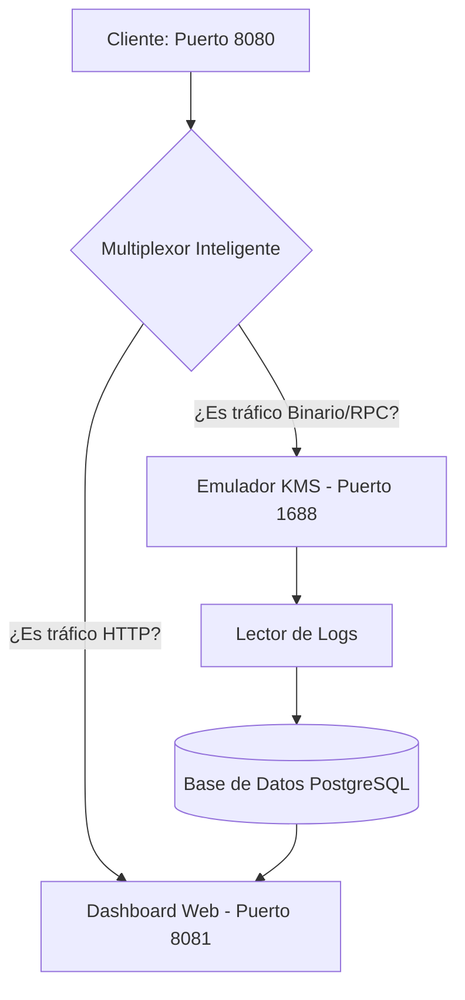
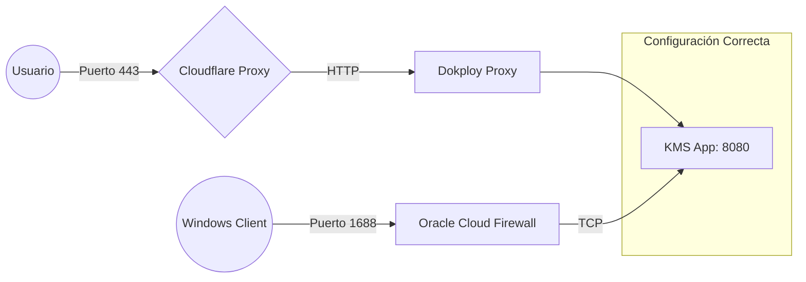

# 🚀 KMS Corporate Management System

[](https://spring.io/projects/spring-boot)
[](https://kotlinlang.org/)
[](https://www.docker.com/)

> [!CAUTION]
> **⚠️ DESCARGO DE RESPONSABILIDAD**: Este proyecto ha sido desarrollado exclusivamente con fines **educativos, de investigación y de prueba** en entornos controlados. El autor no se hace responsable del uso indebido de esta herramienta. Se recomienda cumplir siempre con los términos de licencia de software de los proveedores correspondientes.

Una solución integral y moderna para la gestión de activaciones KMS corporativas. Este sistema combina la potencia del emulador `vlmcsd` con un Dashboard administrativo premium bajo una arquitectura de **puerto unificado**.

---

## 🧠 ¿Cómo funciona? (Arquitectura)

A diferencia de otros servidores KMS, este sistema utiliza un **TCP Multiplexer** avanzado que permite que todo funcione bajo el puerto **8080**:



1.  **Tráfico Web**: Si entras desde un navegador, el sistema detecta HTTP y te muestra el **Dashboard**.
2.  **Tráfico de Activación**: Si Windows o Office intentan activarse, el sistema detecta tráfico KMS y lo redirige al emulador interno.
3.  **Monitoreo**: Un servicio inteligente lee los logs del emulador en tiempo real y guarda cada activación exitosa en la base de datos.

---

## 🌐 Esquema de Conectividad y Puertos

Para que el sistema sea accesible desde el exterior, la red debe estar configurada siguiendo este esquema:



> [!IMPORTANT]
> **⚠️ REGLA DE ORO**: Para la activación (puerto 1688), el tráfico **NO** puede pasar por el proxy de Cloudflare. Debe ir directo del cliente al firewall de tu VPS.

---

## ✨ Características Principales

- 🪟 **Dashboard Glassmorphism**: Visualización de datos con gráficas interactivas (Chart.js).
- 🛡️ **Seguridad Corporativa**: Acceso protegido con Spring Security y BCrypt.
- 🔄 **Log Sniffing**: Captura automática de nombre de máquina y tipo de software.
- 📦 **Docker Unified**: Un solo contenedor para App y Emulador.
- 🚀 **Despliegue Rápido**: Totalmente compatible con Dokploy y entornos de nube.

---

## 🛠️ Guía de Setup (Paso a Paso)

### 1. Preparación de la Nube (Oracle Cloud / VPS)
El sistema utiliza el puerto **1688 (TCP)** para las activaciones externas.
- **Firewall de la Nube**: Abre el puerto `1688` en las reglas de entrada (Ingress Rules) de tu red virtual.
- **Firewall del Sistema**: Ejecuta estos comandos vía SSH:
  ```bash
  sudo iptables -I INPUT -p tcp --dport 1688 -j ACCEPT
  sudo netfilter-persistent save
  ```

### 2. Configuración en Dokploy / Docker
1.  **Variables de Entorno**: Configura en tu panel de control:
    - `DB_HOST`, `DB_PORT`, `DB_NAME`, `DB_USER`, `DB_PASSWORD`
    - `ADMIN_USERNAME`, `ADMIN_PASSWORD` (Para tu acceso al Dashboard)
2.  **Mapeo de Puertos**: Añade el siguiente mapeo:
    - `Published: 1688` -> `Target: 8080` (Protocolo: TCP)
3.  **Dominio**: Configura tu dominio apuntando al puerto `8081` interno (HTTP).

> [!IMPORTANT]
> **Cloudflare Warning**: Si usas Cloudflare, el registro DNS **DEBE ESTAR EN MODO DNS ONLY** (Nube Gris). El proxy de Cloudflare no es compatible con el protocolo KMS.

---

## 🔑 Guía de Activación

### 💻 Windows 10 / 11 Pro
Ejecuta como Administrador:
```powershell
slmgr.vbs /ipk W269N-WFGWX-YVC9B-4J6C9-T83GX
slmgr.vbs /skms tu-dominio.com
slmgr.vbs /ato
```

### 📂 Microsoft Office (LTSC / Volume)
Navega a la carpeta de Office (ej: `C:\Program Files\Microsoft Office\Office16`):
```powershell
cscript ospp.vbs /sethst:tu-dominio.com
cscript ospp.vbs /act
```

---

## 📊 Dashboard Administrativo

Accede vía `https://tu-dominio.com` para ver:
- **Estadísticas Globales**: Total de activaciones y estado del sistema.
- **Gráfica de Historial**: Tendencia de activaciones por día.
- **Distribución**: Qué software se activa más (Windows vs Office).
- **Logs Detallados**: Nombre de la máquina, software y fecha exacta.

---

## 🛠️ Desarrollo y Estructura

- `src/main/kotlin`: Lógica central en Kotlin.
- `src/main/resources`: UI con Thymeleaf y CSS moderno.
- `TcpMultiplexerService.kt`: El selector inteligente de tráfico.
- `KmsEmulatorService.kt`: El motor de escucha y persistencia de activaciones.

---
Desarrollado con fines educativos y de investigación. 🛡️
